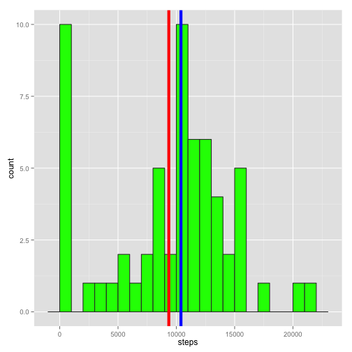
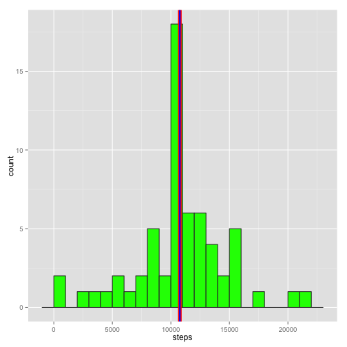

# Reproducible Research: Peer Assessment 1


## Loading and preprocessing the data

1. Load the data (i.e. read.csv())

2. Process/transform the data (if necessary) into a format suitable for your analysis
summary(cars)


```r
library(plyr)
library(ggplot2)

df <- read.csv("activity.csv")
str(df)
```

```
## 'data.frame':	17568 obs. of  3 variables:
##  $ steps   : int  NA NA NA NA NA NA NA NA NA NA ...
##  $ date    : Factor w/ 61 levels "2012-10-01","2012-10-02",..: 1 1 1 1 1 1 1 1 1 1 ...
##  $ interval: int  0 5 10 15 20 25 30 35 40 45 ...
```


## What is mean total number of steps taken per day?

For this part of the assignment, you can ignore the missing values in the dataset.

1. Make a histogram of the total number of steps taken each day

2. Calculate and report the mean and median total number of steps taken per day

The mean is shown in **<span style="color:red;">Red</span>**.
The median is shown in **<span style="color:blue;">Blue</span>**.


```r
df2 <- ddply(df, .(date), summarize,
             steps = sum(steps, na.rm=T))

steps_mean <- mean(df2$steps)
steps_median <- median(df2$steps)

m <- ggplot(df2, aes(x=steps)) +
  geom_histogram(colour = "gray20", fill = "green", binwidth = 1000) + 
  geom_vline(xintercept=steps_mean, colour="red", size=2) +
  geom_vline(xintercept=steps_median, colour="blue", size=2)
m 
```

 

The mean is 9354 steps.  
The median is 10395 steps.

## What is the average daily activity pattern?

1. Make a time series plot (i.e. type = "l") of the 5-minute interval (x-axis) and the average number of steps taken, averaged across all days (y-axis)

2. Which 5-minute interval, on average across all the days in the dataset, contains the maximum number of steps?


```r
df3 <- ddply(df, .(interval), summarize,
             steps = mean(steps, na.rm=T))

m <- ggplot(df3, aes(interval, steps)) +
  geom_line()
m
```

 

```r
max_interval <- subset(df3, steps == max(steps))
max_interval
```

```
##     interval steps
## 104      835 206.2
```

The interval with the most steps is 835.  
It has 206.2 steps.


## Imputing missing values

Note that there are a number of days/intervals where there are missing values (coded as NA). The presence of missing days may introduce bias into some calculations or summaries of the data.

1. Calculate and report the total number of missing values in the dataset (i.e. the total number of rows with NAs)

2. Devise a strategy for filling in all of the missing values in the dataset. The strategy does not need to be sophisticated. For example, you could use the mean/median for that day, or the mean for that 5-minute interval, etc.

3. Create a new dataset that is equal to the original dataset but with the missing data filled in.

4. Make a histogram of the total number of steps taken each day and Calculate and report the mean and median total number of steps taken per day. Do these values differ from the estimates from the first part of the assignment? What is the impact of imputing missing data on the estimates of the total daily number of steps?

### Strategy Explaination
My strategy for inputing missing data is to replace the NA with the mean for that interval.
This is done with an input.mean function applied inside the ddply summarization. 


```r
na_count <- sum(is.na(df$steps))
na_count
```

```
## [1] 2304
```

```r
impute.mean <- function(x) replace(x, is.na(x), mean(x, na.rm = TRUE))

df4 <- ddply(df, ~ interval, transform, 
             steps = impute.mean(steps))

df4 <- arrange(df4, date, interval)

df5 <- ddply(df4, .(date), summarize,
             steps = sum(steps, na.rm=T))

steps_mean_2 <- mean(df5$steps)
steps_median_2 <- median(df5$steps)

steps_mean
```

```
## [1] 9354
```

```r
steps_mean_2
```

```
## [1] 10766
```

```r
steps_median
```

```
## [1] 10395
```

```r
steps_median_2
```

```
## [1] 10766
```

```r
m <- ggplot(df5, aes(x=steps)) +
  geom_histogram(colour = "gray20", fill = "green", binwidth = 1000) + 
  geom_vline(xintercept=steps_mean_2, colour="red", size=2.5) +
  geom_vline(xintercept=steps_median_2, colour="blue", size=1)
m 
```

 

There are 2304 intervals with missing step data.

Beacause so many steps where filled in with the median fo the interval, The mean and the median are now the same. They are also both higher than before. We no longer see days with zero steps. This was skewing the data to under report the average number of steps per day.

Again the mean is shown in **<span style="color:red;">Red</span>** and the median is shown in **<span style="color:blue;">Blue</span>**.

## Are there differences in activity patterns between weekdays and weekends?

For this part the weekdays() function may be of some help here. Use the dataset with the filled-in missing values for this part.

1. Create a new factor variable in the dataset with two levels – “weekday” and “weekend” indicating whether a given date is a weekday or weekend day.

2. Make a panel plot containing a time series plot (i.e. type = "l") of the 5-minute interval (x-axis) and the average number of steps taken, averaged across all weekday days or weekend days (y-axis). The plot should look something like the following, which was creating using simulated data:


```r
df4$date <- as.Date(df4$date)
df4$day <- weekdays(df4$date)

set_day_type <- function(day) {
  if(day %in% c('Saturday','Sunday')) "weekend" else "weekday"  
}

df4$day_type <- sapply(df4$day, set_day_type)

df6 <- ddply(df4, .(interval, day_type), summarize,
             steps = mean(steps, na.rm=T))

m <- ggplot(df6, aes(interval, steps)) +
  geom_line() +
  facet_grid( day_type ~ .)
m
```

 

Acitivty on weekdays peaks in the morning. There are also some small evening peaks.
On the weekend there is a less signficant peak in the morning and higher activity and peaks through out the day.
